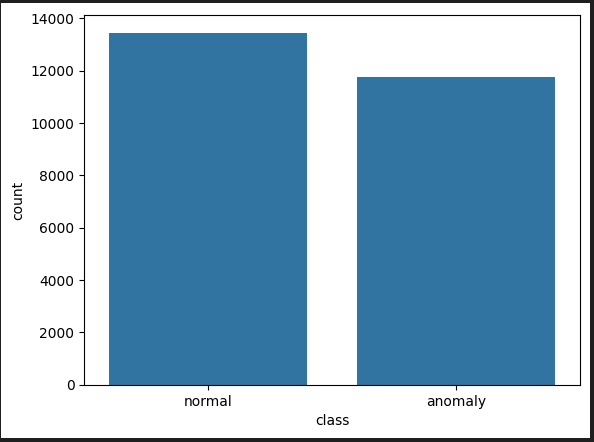
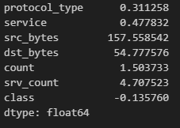
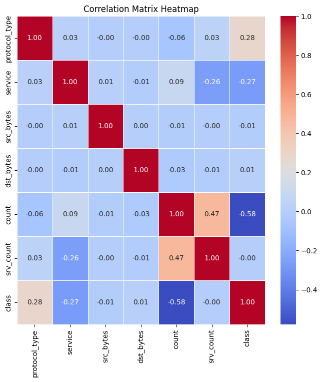
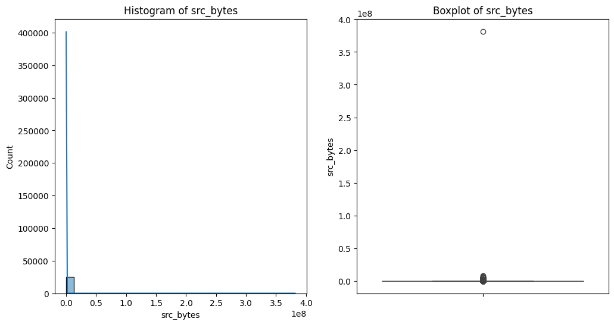
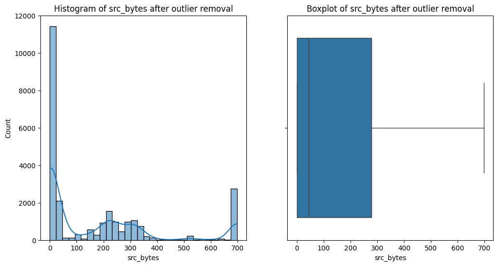
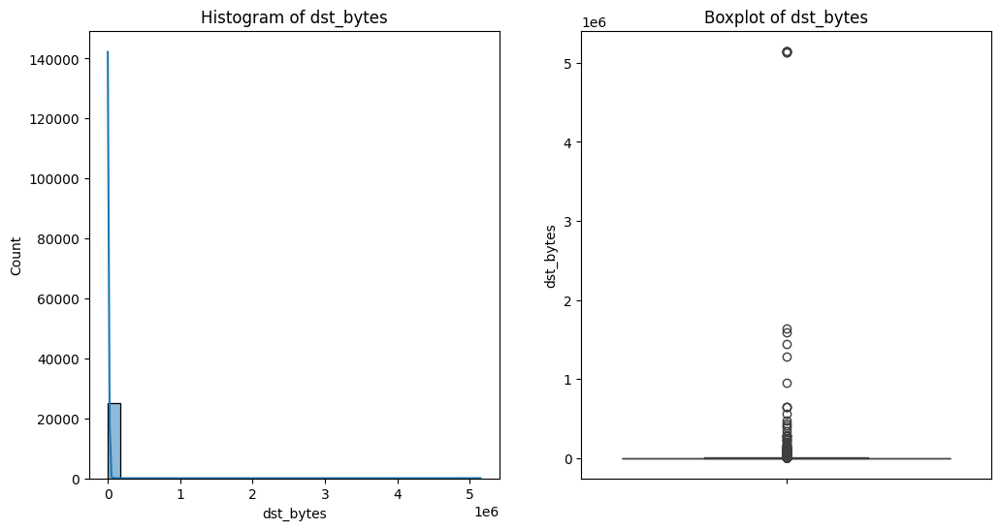
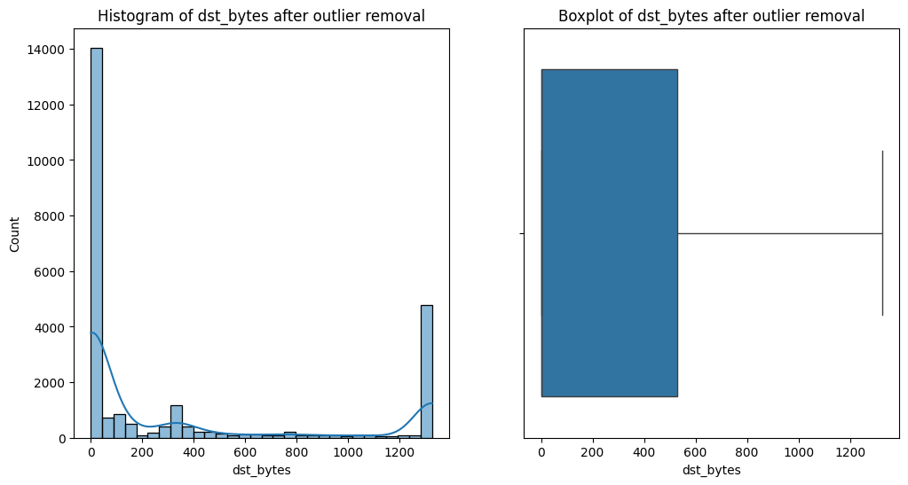
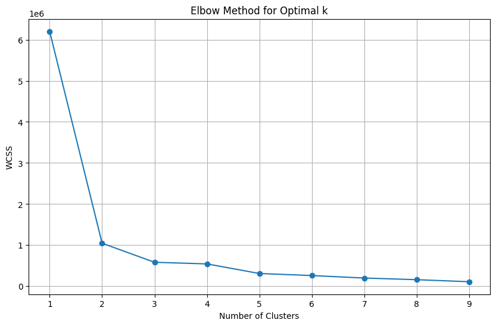
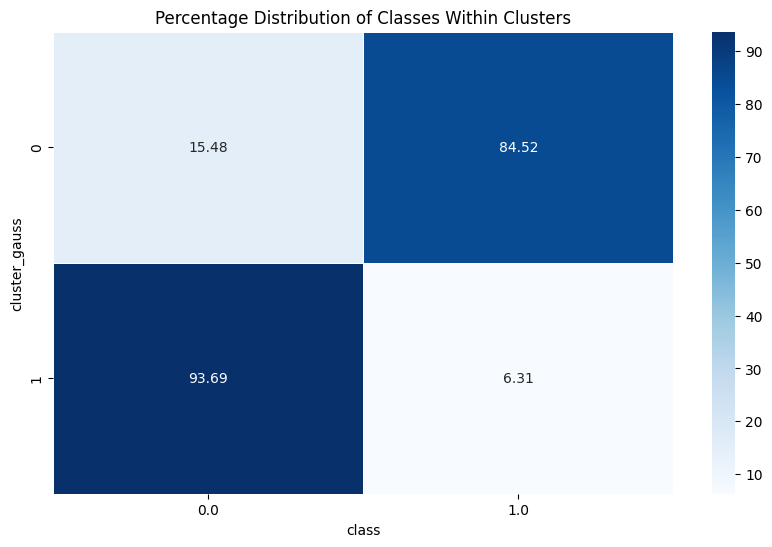
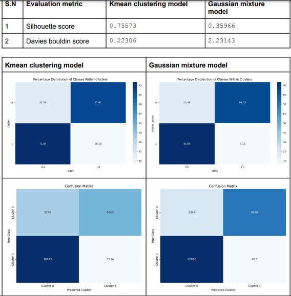

<h1>Data Source</h1>

This dataset is sourced from <a href =https://www.kaggle.com/datasets/sampadab17/network-intrusion-detection?select=Train_data.csv>kaggle dataset<a>

<h1>Data Cleaning</h1>

    <ol>
        <li>Firstly the structure of dataset and presence of null value is checked.</li>
        <li>Few features were selected namely: 
            <ul>
                <li>protocol_type</li>
                <li>service</li>
                <li>src_bytes</li>
                <li>dst_bytes</li>
                <li>count</li>
                <li>srv_count</li>
                <li>class</li>
        </li>
        <li>Class distribution is observed: 
            

            
            

        <li>Normality Test</li>
            <ul>
                <li>OrdinalEncoding is performed to all the object columns with modification to handle unseen data as well:</li>
                    <li>Skewness and Correlation between features is calculated: 
                        

                        

                    </li> 
                </li>
            </ul>
        <li>EDA 
            
The main focus were the features with very high skewness ("src_bytes", "dst_bytes")

            
Histogram and box plot is plotted before outliers handelling by using ICQ, replacement approach is used. The outliers are replaced with the upper and lower bound.

            

            

            

            

        </li>
        <li>Standardization
            
Standardization is performed to <b>all the numeric features('src_bytes', 'count', 'srv_count', 'dst_bytes')</b> to bring all the features in same scale.

            
The cleaned data is stored

        </li>  
    </ol>

<h1>Model Training</h1>

For model comparision two different clustering models were used.

    <ul>
        <li>Elbos Method 
            
 Elbos method is used to find the optimal number of cluster for data. The optimal number of cluster is found to be 2 as shown below.

            

        </li>
        <li>KMean clustering 
            
As clustering is a unsupervised model, to identify the model performance and actual label indication of cluster we analyzed the predicted cluster and the actual label and the result is found as:

            <ol>
                <li> cluster 0 represent label 1 data which is normal data points</li>
                <li> cluster 1 represent label 0 data which is anomalous data points</li>
            </ol>
            

        </li>
        <li> Gaussian Mixture model  
            
 From gaussian model the predicted cluster and the actual label and the result is found as:

            <ol>
                <li> cluster 0 represent label 1 data which is normal data points</li>
                <li> cluster 1 represent label 0 data which is anomalous data points</li>
            </ol>
            

        </li>
    </ul>

<h1>Model Comparison</h1>

From above evaluation metrics although silhouette score of kmean clustering is high, we are choosing gaussian mixture model as our main model as it has higher davies bouldin score and from above images we can gaussian mixture model is more effectively clustering the data points.

<h1>Model Deployment</h1>

The link to streamlit code is <a href =https://github.com/bikeshmdr/network_anamoly_detection>github.com<a>

The deployed link for streamlit is <a href =https://networkanamolydetectiondeployment-jjgwgf3gkva2sryrstrvik.streamlit.app>streamlit.io<a>

<h1>Demo</h1>